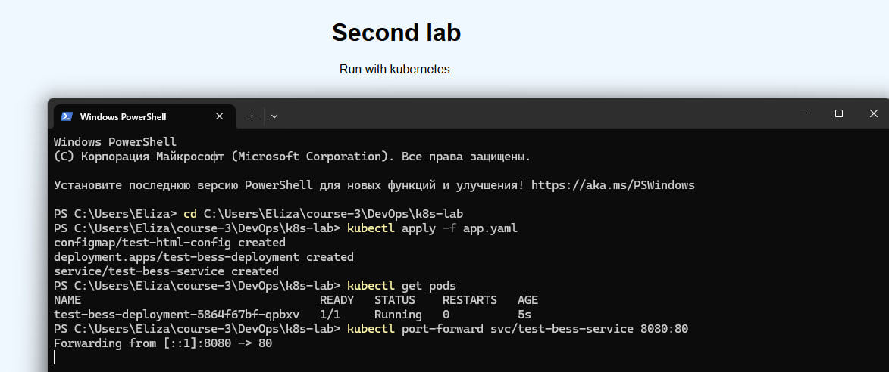
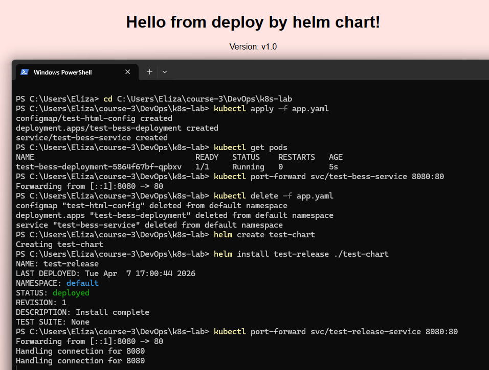
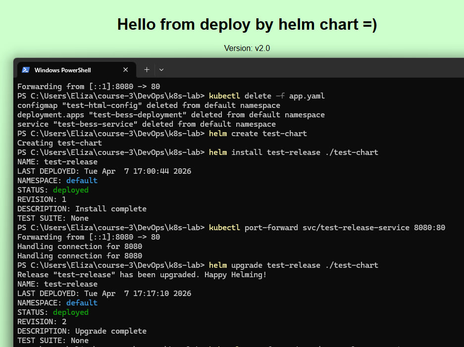

# Отчет по лабораторной работе №2: Kubernetes и Helm

Выполнила Шангина Елизавета, студентка группы N3346

## Часть 1: Манифесты Kubernetes

В первой части работы был реализован деплой веб-сервиса с использованием стандартных объектов Kubernetes. 
Чтобы избежать необходимости сборки и публикации собственного Docker-образа, был применен паттерн внедрения конфигурации через ConfigMap.

### Описание используемых ресурсов:

1.  **ConfigMap (`test-html-config`)**: 
    - *Назначение*: отделение статических данных от логики приложения. 
    - *Что делает*: содержит исходный код файла `index.html`. Это позволяет использовать стандартный образ Nginx, подменяя его приветственную страницу.
2.  **Deployment (`test-bess-deployment`)**:
    - *Назначение*: описание желаемого состояния приложения.
    - *Что делает*: гарантирует запуск одного пода с образом `nginx:1.25-alpine`. В блоке `volumes` происходит подключение ConfigMap, а в `volumeMounts` прописан путь `/usr/share/nginx/html/index.html`, куда файл должен быть загружен.
3.  **Service (`test-bess-service`)**:
    - *Назначение*: обеспечение сетевой доступности.
    - *Что делает*: создает виртуальный IP-адрес и селектор, перенаправляющий трафик на поды с меткой `app: test-bess-app`.

### Ход работы:
1. Создан манифест `app.yaml`.
2. Выполнена команда применения конфигурации:
   ```bash
   kubectl apply -f app.yaml
   ```
3. Проведена проверка состояния объектов:
   ```bash
   kubectl get pods
   ```
4. Для проверки работоспособности в браузере организован проброс портов:
   ```bash
   kubectl port-forward svc/test-bess-service 8080:80
   ```

**Результат:** сервис успешно запущен, в браузере отображается созданная страница.


---

## Часть 2: Helm Chart

Во второй части работы те же ресурсы были преобразованы в **Helm Chart** — пакет, позволяющий параметризировать установку.

### Структура созданного чарта:
- `values.yaml`: файл с переменными. Позволяет менять настройки (цвет фона, текст, количество копий), не исправляя основной код манифестов.
- `templates/test-resources.yaml`: шаблон манифестов, использующий синтаксис Go-templates (например, `{{ .Values.appParams.bgColor }}`).
- `Chart.yaml`: метаданные чарта (имя, версия).

### Реализация и апгрейд релиза:

1.  **Установка**:
    Команда: `helm install test-release ./test-chart`
    Helm собрал манифесты, подставил в них значения из `values.yaml` и отправил их в API Kubernetes.



2.  **Проблема автоматического обновления**:
    при изменении данных в ConfigMap через `helm upgrade`, Kubernetes по умолчанию не перезапускает поды, так как описание контейнера не изменилось. Чтобы сервис обновлялся автоматически, в шаблон Deployment была добавлена аннотация:
    `checksum/config: {{ include (print $.Template.BasePath "/my-resources.yaml") . | sha256sum }}`
    Это заставляет Kubernetes видеть изменение в Deployment при каждом изменении конфига и инициировать перезапуск подов.

3.  **Апгрейд**:
    после изменения `values.yaml` (изменен цвет на зеленый, увеличено число реплик) выполнена команда:
    ```bash
    helm upgrade test-release ./test-chart
    ```

**Результат:** после выполнения апгрейда страница в браузере обновилась мгновенно, что подтверждает корректную работу механизма отслеживания изменений.

    
---

## Часть 3: Контрольные вопросы

На основе выполненной работы можно выделить три ключевых преимущества Helm:

### 1. Параметризация и гибкость
В классических манифестах все значения зафиксированы и в случаях, если необходимо изменить заголовок или лимиты памяти, то нужно исправлять код инфраструктуры. Helm предлагает вынести все настройки в один файл `values.yaml`, что позволяет использовать один и тот же чарт для разных сред (Dev/Staging/Prod), просто подставляя разные файлы параметров.

### 2. Жизненный цикл и атомарность
Классический `kubectl apply` просто обновляет ресурсы. Helm вводит понятие релиза, что дает возможность отслеживать историю версий (`helm history test-release`) и, соответственно, дает возможность делать откаты до нужной версии ( `helm rollback my-release [номер_версии]`).

### 3. Управление сложностью и зависимостями
Современные приложения состоят из множества ресурсов (Deployments, Services, Ingress, RBAC-роли, Secrets). Управлять ими вручную через `kubectl` сложно, так как можно легко забыть обновить один из файлов. Helm же выступает в роли пакетного менеджера и позволяет устанавливать сложные архитектурные решения при помощи одной команды (`helm install bitnami/postgresql`). 

---

## Вывод
В ходе лабораторной работы был изучен полный цикл развертывания приложения в Kubernetes: от написания базовых манифестов до создания гибкого и масштабируемого Helm-чарта. Был освоен механизм обновления конфигурации без простоя сервиса и изучены преимущества пакетного управления облачной инфраструктурой.
