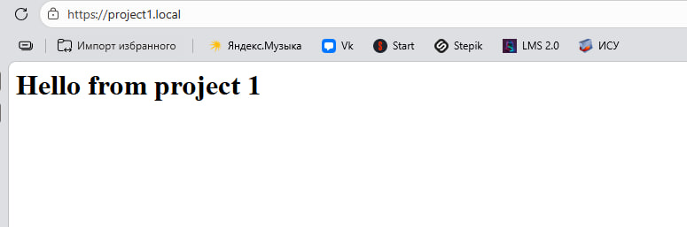
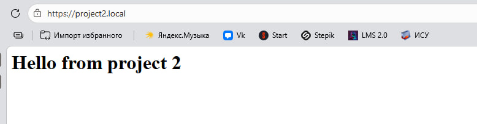
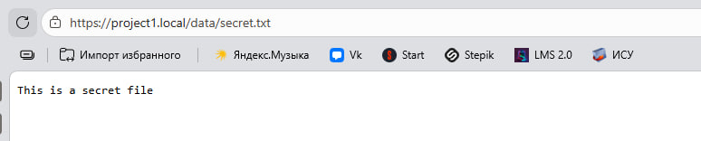
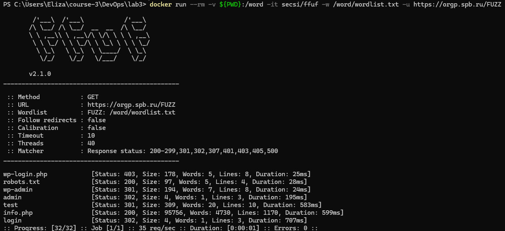
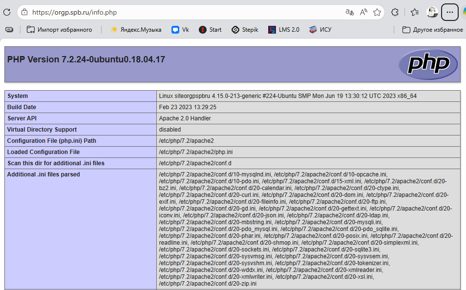
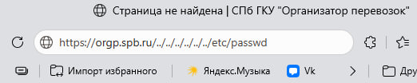
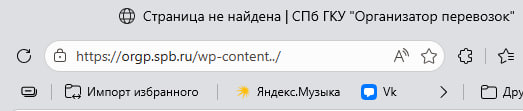

# Отчет по лабораторной работе №3: Настройка и аудит безопасности веб-сервера Nginx

Выполнила Шангина Елизавета, студентка группы N3346

## Часть 1: Конфигурация Nginx

Был развернут локальный веб-сервер Nginx через Docker Compose, обслуживающий два независимых проекта. В файл `hosts` добавлены записи для локальной маршрутизации доменов.

### Реализованные требования:
1. **Работа по HTTPS:** cгенерирован  SSL-сертификат (OpenSSL, RSA 2048), ключи примонтированы в контейнер.
2. **Принудительное перенаправление HTTP -> HTTPS:** настроен редирект (код 301) с 80 порта на 443.
3. **Использование alias:** для `project1.local` настроен location `/data/`, перенаправляющий запросы в скрытую физическую директорию `/shared/`.
4. **Виртуальные хосты:** настроено два блока `server` для разделения трафика между `project1.local` и `project2.local`.
5. **Настройка безопасности:** добавлена директива `server_tokens off;` для скрытия версии Nginx в ответах сервера.

---

## Часть 2: Аудит безопасности

В качестве цели для тестирования был выбран сайт `https://orgp.spb.ru`. Аудит проводился в рамках этичного хакинга (black-box тестирование без деструктивного воздействия). Проверено 3 вектора атак:

### 1. Поиск скрытых директорий и файлов (Directory Fuzzing)
**Инструмент:** 
утилита `ffuf` (через Docker-контейнер `secsi/ffuf`).

**Описание:** 
с помощью специализированного словаря производился поиск оставленных разработчиками конфигурационных и отладочных файлов.

**Результат:** 
был обнаружен доступный извне отладочный файл `info.php` (статус 200 OK, размер ~95 КБ), содержащий вывод функции `phpinfo()`. 

**Анализ уязвимости:** данная конфигурационная ошибка приводит к утечке информации. Злоумышленник получает доступ к данным о версии ОС, архитектуре, абсолютным путям и загруженным модулям. 
Однако, с точки зрения оценки бизнес-рисков, данная уязвимость не является критической. Для ресурса подобного уровня риск массовой эксплуатации минимален, хотя при проведении целевой атаки данная информация значительно упростит злоумышленнику подбор специфичных эксплойтов.

### 2. Path Traversal (LFI - Чтение локальных файлов)
**Описание:** 
уязвимость позволяет злоумышленнику с помощью символов `../` выйти за пределы корневой веб-директории и прочитать системные файлы сервера (например, `/etc/passwd`).

**Тестирование:** 
были произведены запросы к серверу с использованием типичных payload-ов: `https://orgp.spb.ru/../../../../../../etc/passwd`.

**Результат:** 
сервер и WAF нормализуют URI-запросы. Попытка выхода за пределы директории блокируется сервером с возвратом страницы ошибки (404/403). Механизмы защиты настроены верно.

### 3. Nginx Off-by-Slash (Ошибка конфигурации Alias)
**Описание:** 
специфичная уязвимость Nginx. Возникает, если в конфиге директива `location` не заканчивается слэшем, а директива `alias` заканчивается. Позволяет читать смежные директории.

**Тестирование:** 
на основе предыдущего теста было выявлено наличие директории `wp-content`. Был сформирован запрос: `https://orgp.spb.ru/wp-content../` в попытке прочитать файлы на уровень выше.

**Результат:** 
сервер корректно обработал запрос и не позволил совершить обход директорий, выдав ошибку. Блоки location на целевом сервере сконфигурированы безопасно.

---

### Общий вывод
В ходе лабораторной работы были успешно настроены безопасные конфигурации для собственного веб-сервера. Аудит внешнего ресурса продемонстрировал, что несмотря на базовую защищенность современных сайтов от примитивных атак, человеческий фактор и халатность при деплое всё ещё остаются актуальным вектором для сбора информации перед целевыми атаками.
