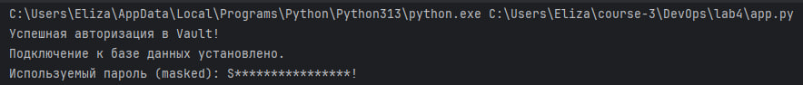

# Отчет по лабораторной работе №4: CI/CD и управление секретами

Выполнила Шангина Елизавета, студентка группы N3346

## Часть 1: CI/CD Пайплайны

В ходе выполнения данной части лабораторной работы были написаны два конфигурационных файла для GitHub Actions. В файле `bad-ci.yml` было использовано 5 антипаттернов. В `good-ci.yml` предложены исправления. Пайплайн состоит из 5 этапов (Jobs): `lint`, `test`, `build`, `deploy-staging`, `deploy-prod`.

### 5 плохих практик в `bad-ci.yml`:

1. **Глобальные триггеры (`on: [push, pull_request]`)**
   - **Почему плохо:** пайплайн запускается на каждый коммит в любую ветку, что является пустой тратой времени и ресурсов.
   - **Как исправлено:** в `good-ci.yml` настроен триггер только на изменения в ветке `main` (`branches: - main`).
   - **Влияние:** экономия ресурсов инфраструктуры.

2. **Использование плавающих тегов (`ubuntu-latest`, `@latest`)**
   - **Почему плохо:** при обновлении версии ОС или экшена пайплайн может перестать корректно работать.
   - **Как исправлено:** жесткая фиксация версий (`ubuntu-22.04`, `actions/checkout@v4`).
   - **Влияние:** гарантия детерминированности сборок.

3. **Игнорирование ошибок тестирования (`continue-on-error: true`)**
   - **Почему плохо:** при падении тестов пайплайн загорится "зеленым" и некорректный код будет залит на боевой сервер, что лишает смысла применение техники Continuous Integration.
   - **Как исправлено:** строка удалена. Теперь любой ненулевой код возврата останавливает процесс.
   - **Влияние:** защита окружения прода от багов.

4. **Отсутствие зависимостей между этапами (отсутствие `needs`)**
   - **Почему плохо:** по умолчанию jobs в GitHub Actions запускаются *параллельно*. Деплой на сервер начнется одновременно с линтером и тестами, до того, как соберется образ.
   - **Как исправлено:** выстроена строгая топология с помощью ключа `needs` (`test` ждет `lint`, `build` ждет `test` и т.д.).
   - **Влияние:** логически правильная и безопасная последовательность доставки кода.

5. **Отсутствие кэширования зависимостей**
   - **Почему плохо:** установка библиотек каждый раз сильно замедляет пайплайн.
   - **Как исправлено:** добавлен шаг `actions/cache@v3`.
   - **Влияние:** время выполнения сборки сокращается с минут до секунд благодаря переиспользованию кэша.

---

## Часть 2: Безопасная работа с секретами 

Для демонстрации работы с секретами через Docker Compose был локально поднят сервис **HashiCorp Vault**. В хранилище был помещен пароль БД. 
Написан сервис-скрипт `app.py`, который аутентифицируется в Vault, забирает пароль и маскирует его перед выводом в логи (Masking), чтобы предотвратить утечку.

### Ответы на теоретические вопросы:

#### 1. Почему хранение секретов в CI/CD переменных репозитория — плохая практика?
- **Проблема "Разрастания секретов":** Когда у вас 50 микросервисов, вам нужно вручную прописывать пароль от БД в 50 разных репозиториях. При изменении пароля его нужно переписывать в 50 местах.
- **Отсутствие ротации и динамичности:** переменные в CI/CD статичны и могут храниться годами. 
- **Отсутствие аудита:** нельзя точно сказать, какой именно процесс или разработчик в данный момент прочитал секрет из переменных GitLab.
- **Риск кражи:** любой разработчик, имеющий права на редактирование файла `.gitlab-ci.yml` или `.github/workflows`, может добавить команду `echo $MY_SECRET > file.txt` и украсть секрет.

#### 2. Почему подход с HashiCorp Vault является хорошей практикой?
- **Единая точка правды:** все секреты компании хранятся в одном зашифрованном сейфе. Изменили пароль в Vault — он автоматически обновился для всех сервисов.
- **Динамические секреты:** вместо хранения постоянного пароля от базы данных, Vault может генерировать одноразовые логин и пароль для CI/CD пайплайна, который удалится после деплоя.
- **Шифрование Transit:** Vault может шифровать данные приложения не отдавая ключи шифрования наружу.
- **Аудит:** Vault ведет детальный лог: кто, когда, с какого IP-адреса и по какому токену запрашивал конкретный секрет.
