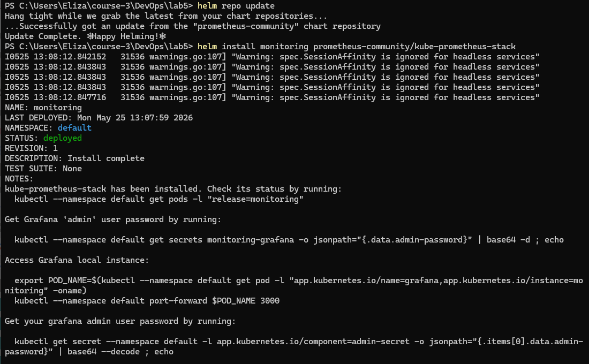
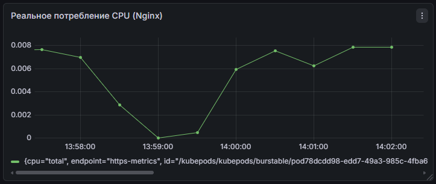
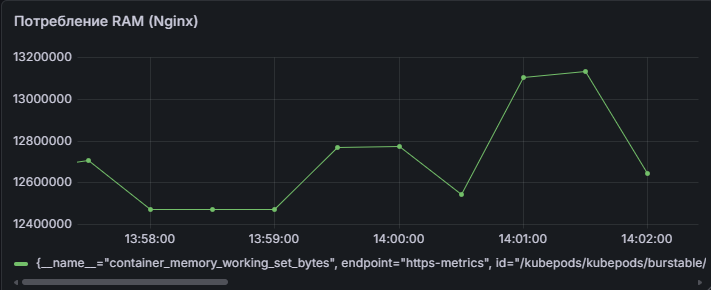

# Отчет по лабораторной работе №5: Мониторинг сервиса в Kubernetes

Выполнила Шангина Елизавета, студентка группы N3346

## 1. Развертывание тестового сервиса
Для мониторинга был написан манифест `app.yaml`, создающий деплой легковесного веб-сервера Nginx с названием `monitored-app`. В манифесте были заданы лимиты ресурсов (CPU: 10m, Memory: 64Mi).

Запуск в кластер выполнен командой:
`kubectl apply -f app.yaml`

Для обеспечения доступа к приложению и проведения нагрузочного тестирования был выполнен прямой проброс порта до деплоя:
`kubectl port-forward deploy/monitored-app 8151:80`


---

## 2. Развертывание стека мониторинга 
Установка производилась через пакетный менеджер Helm. Был использован официальный чарт `kube-prometheus-stack`, реализующий паттерн Prometheus Operator.

`helm repo add prometheus-community https://prometheus-community.github.io/helm-charts`

`helm repo update`

**Решение инфраструктурной проблемы:**
При локальном запуске кластера через Docker Desktop стандартный `node-exporter` переходит в статус `CrashLoopBackOff`, так как пытается смонтировать системные пути хост-ОС Linux, отсутствующие в виртуальной машине. Для решения проблемы был применен конфигурационный патч `fix.yaml`, отключающий конфликтующие монтирования:

```yaml
prometheus-node-exporter:
  hostRootFsMount:
    enabled: false
```

Установка стека мониторинга с применением патча:
`helm install monitoring prometheus-community/kube-prometheus-stack -f fix.yaml`



Доступ к веб-интерфейсу Grafana осуществлен через:
`kubectl port-forward deployments/monitoring-grafana 8081:80`

---

## 3. Анализ метрик и нагрузочное тестирование

От использования базовых дашбордов было решено отказаться в пользу создания собственного дашборда с написанием запросов на языке PromQL. 

Для проверки работоспособности системы сбора метрик на Nginx была подана искусственная нагрузка с помощью бесконечного цикла HTTP-запросов через PowerShell:
`while($true) { Invoke-WebRequest -Uri "http://localhost:8081" -UseBasicParsing | Out-Null }`

В Grafana был использован предустановленный дашборд **"Kubernetes / Compute Resources / Pod"**. В фильтрах был выбран namespace `default` и конкретный pod запущенного сервиса `monitored-app`.

Ниже представлены 2 графика, отражающих состояние поднятого сервиса:
### 1. Потребление процессора

**PromQL:** `rate(container_cpu_usage_seconds_total{pod=~"monitored-app-.*"}[1m])`

*Анализ:* На графике зафиксирован провал и последующий резкий всплеск потребления процессорного времени, который совпадает со временем перезапуска скрипта нагрузочного тестирования.


### 2. Потребление оперативной памяти
**PromQL:** `container_memory_working_set_bytes{pod=~"monitored-app-.*"}`

*Анализ:* График демонстрирует стабильное потребление оперативной памяти процессом Nginx (в пределах нескольких МБ). Аномалий и утечек памяти под нагрузкой не выявлено.





---

## Вывод
Лабораторная работа выполнена в полном объеме. 
1. Разрешена архитектурная проблема совместимости `node-exporter` с локальным кластером.
2. Проведена успешная интеграция компонентов Prometheus (хранилище TSDB) и Grafana (визуализатор).
3. Написаны собственные PromQL-запросы для детального мониторинга конкретного пода.
4. С помощью нагрузочного тестирования доказана минимальная задержка между генерацией нагрузки на сервис и ее отображением на графиках телеметрии.
